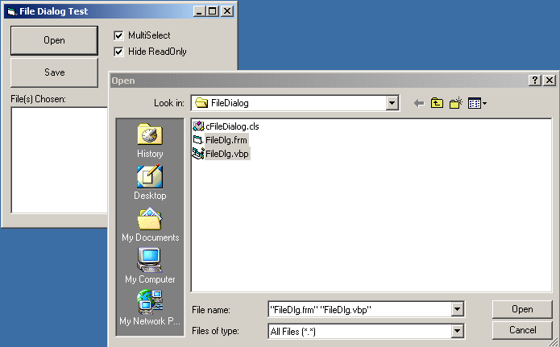

<div align="center">

## File Dialog Class \(replace  common dialog control with this lightweight class\)


</div>

### Description

Replaces Microsoft's common dialog control file dialog features. Uses same interface to call the FileOpen and FileSave dialogs including multiselection support.

Instead of making a more versatile control with print dialogs, color dialogs, and hooking, I decided to make a very lightweight one since the CommonControl Print and Color Dialogs are

essentially useless.

I could have added hooking functionality, but that would involve including a standard module

as well. The only major benefit of hooking is the ability to center the dialog. However,

with this code, as long as you specify the form's handle, it will position the dialog to the

upper left of the form

This is a direct replacement to the Microsoft CommonDialog control and will involve very little

Change in coding to implement.
 
### More Info
 
File Dialog Options (FileName, Filters, Default Extension, etc..)

selected Filename and/or filenames


<span>             |<span>
---                |---
**Submitted On**   |2001-02-10 09:15:56
**By**             |[Bill Bither](https://github.com/Planet-Source-Code/PSCIndex/blob/master/ByAuthor/bill-bither.md)
**Level**          |Intermediate
**User Rating**    |4.7 (70 globes from 15 users)
**Compatibility**  |VB 5\.0, VB 6\.0
**Category**       |[Files/ File Controls/ Input/ Output](https://github.com/Planet-Source-Code/PSCIndex/blob/master/ByCategory/files-file-controls-input-output__1-3.md)
**World**          |[Visual Basic](https://github.com/Planet-Source-Code/PSCIndex/blob/master/ByWorld/visual-basic.md)
**Archive File**   |[CODE\_UPLOAD147642102001\.zip](https://github.com/Planet-Source-Code/bill-bither-file-dialog-class-replace-common-dialog-control-with-this-lightweight-class__1-15177/archive/master.zip)

### API Declarations

```
GetOpenFileName
GetSaveFileName
```


